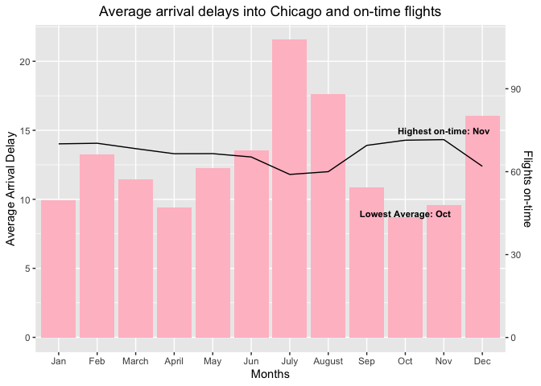
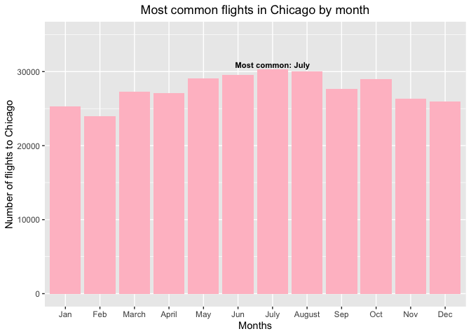
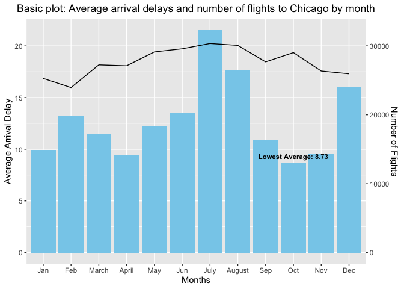
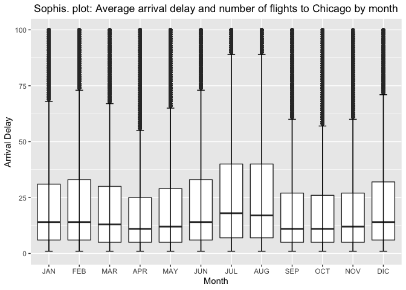
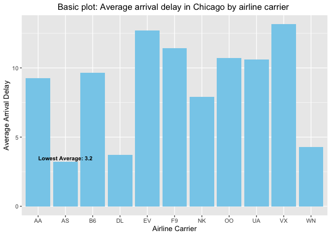
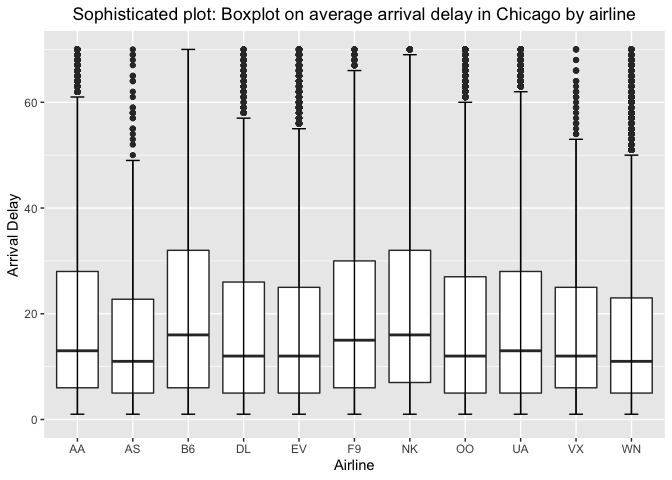
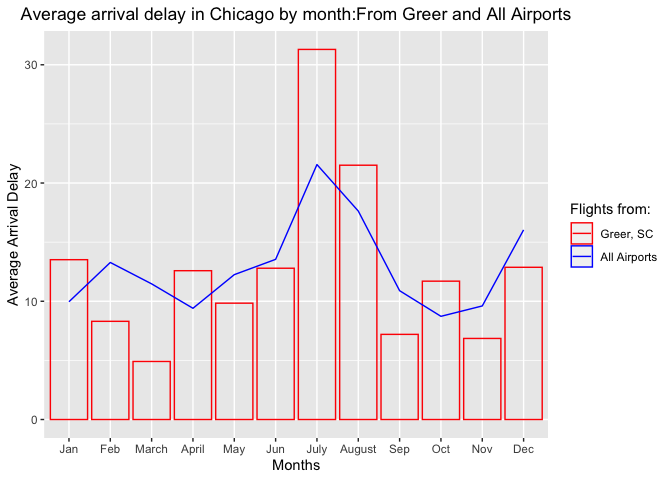

This submission is my work alone and complies with the 30535 integrity
policy.

Add your initials to indicate your agreement: **KEZG**

Add your collaborators: \*\*\_\_\*\*

Late coins used this pset: 0. Late coins left: 5

# Git merge conflicts

You and your partner will share a github remote repository and make
changes and update the same files in your local repositories. This can
be messy, but git has handy tools to deal with potential conflicts
between your versions.

Names of desired files are applied\_ps1.Rmd and applied\_ps1.pdf Please
tag the PDF in gradescope to obtain full credit. We are suggesting the
following workflow to minimize conflicts. Divide the work into
manageable chunks we refer to as “issues”.

*Merge conflicts in Github*

**1. Succinctly explain, why did you have a merge conflict?**

We have a merge conflict because we are both making changes to the same
line of code. GitHub gets confused and doesn’t know which version to
keep or drop. Since GitHub cannot automatically resolve differences in
code, the conflict occurs.

# Flight Data: Part I (30 pts)

An international trade organization is hosting a two-day convention in
Chicago in 2020. The mayor’s tourism office has asked for some planning
help based on historical data from 2016

## Download BTS data

In prior years for this problem set, students downloaded the data
directly from the BTS website. This year when we went to double-check
the problem set, we found that the BTS had broken their own data! Put
otherwise, they took down the on-time flight-level data and say that a
new database is coming soon. This is unfortunately all too common. For
the purposes of 30535 fortunately we archived copies of the data and for
this year only we have posted the data on Canvas

**Read the data into R using il\_flights &lt;- read\_csv(“data.csv”) and
use the bind\_rows command to stitch together the monthly files into a
yearlong file.**

-   Reading the monthly data:

-   Stitching together the monthly files into a yearlong file:

<!-- -->

    il_flights <- bind_rows(il_flights1, il_flights2, il_flights3, il_flights4, 
                            il_flights5, il_flights6, il_flights7, il_flights8, 
                            il_flights9, il_flights10, il_flights11, il_flights12, 
                            id = NULL)

## Data Description (10 pts)

**1. What is the unique identifier for each flight in the dataset?**

Combination of columns that uniquely identifies each row:

-   MONTH , DAY\_OF\_MONTH, OP\_UNIQUE\_CARRIER, ORIGIN\_AIRPORT\_ID,
    DEST\_AIRPORT\_ID, DEP\_TIME

<!-- -->

    il_flights %>%
      filter(MONTH == 11, DAY_OF_MONTH == 1, 
             OP_UNIQUE_CARRIER == "AA", 
             ORIGIN_AIRPORT_ID == 13930 , 
             DEST_AIRPORT_ID == 11278,
             DEP_TIME == 1702)

    ## # A tibble: 1 × 31
    ##    YEAR MONTH DAY_OF_MONTH OP_UNIQUE_CARRIER ORIGIN_AIRPORT_ID ORIGIN_AIRPORT_S…
    ##   <dbl> <dbl>        <dbl> <chr>                         <dbl>             <dbl>
    ## 1  2016    11            1 AA                            13930           1393004
    ## # … with 25 more variables: ORIGIN_CITY_MARKET_ID <dbl>, ORIGIN <chr>,
    ## #   ORIGIN_CITY_NAME <chr>, ORIGIN_STATE_ABR <chr>, DEST_AIRPORT_ID <dbl>,
    ## #   DEST_AIRPORT_SEQ_ID <dbl>, DEST_CITY_MARKET_ID <dbl>, DEST <chr>,
    ## #   DEST_CITY_NAME <chr>, DEST_STATE_ABR <chr>, DEP_TIME <chr>,
    ## #   DEP_DELAY <dbl>, DEP_DELAY_NEW <dbl>, ARR_TIME <chr>, ARR_DELAY <dbl>,
    ## #   ARR_DELAY_NEW <dbl>, CANCELLED <dbl>, AIR_TIME <dbl>, DISTANCE <dbl>,
    ## #   CARRIER_DELAY <dbl>, WEATHER_DELAY <dbl>, NAS_DELAY <dbl>, …

**2. R has six description methods: print, head, str, glimpse, View,
summary. Apply them to il\_flights**

    print(il_flights)

    il_flights %>% head(1000)

    str(il_flights)

    glimpse(il_flights)

    view(il_flights1)

    summary(il_flights)

**- 1. Are any of the methods redundant, in the sense that you don’t
learn anything about the data from these commands that you didn’t
already know from the prior methods? Make a list of the redundant pairs.
Tell us which one you think gives a better output and why.**

Redundant pairs:

-   Print and Head: Both the *head* and *print* commands display the
    data frame data on the R-studio screen. Although the *print* command
    prints a table with 1000 rows by default, and the *head* command
    does not (only prints 6 rows by default), the head command may be
    used to provide the same results as the *print* command when using::
    il\_flights %&gt;% head(1000). These commands must be distinguished
    from *view*, which allows you to better visualize all of the table’s
    data (rows and columns) in a separate window and in a more
    comfortable manner.

-   Str and Glimpse: *Str* displays the internal structure per column of
    the dataset and gives information about the rows, also provides
    information like the name of the column, number of rows per column,
    and class. However, the output is large because it gives two chunks
    of information. Meanwhile, *Glimpse* provides more information about
    the data in the rows (display more of each row’s values) as well as
    the class of each column and the document’s size, but in a more
    compact manner than *Str*. As a result, we may infer that the
    *Glimpse* command produces a better result since it is more concise.

**- 2. Of the non-redundant methods, write a note (max 2 lines per
command) that will quickly help someone (perhaps future you!) recall how
each command is useful.**

Non-redundant methods:

-   View: The *view* function invokes a separate spreadsheet data viewer
    in R, and provides a display of the entire contents of the data
    frame.
-   Summary: This command provides a statistical summary of the data per
    column. When it comes to numerical data, the displayed statistics
    include Min, max, quartiles 1 and 3, median and average, as well as
    the amount of N.A that exists in the column.

## Data Validation (20 pts)

**1. You should have 675822 rows when you downloaded data for Illinois.
Load the package testthat and then test that you have this many rows
using the command test\_that(“we have the right number of
rows”,expect\_equal(nrow(data),675822))**

    test_that("we have the right number of rows",
              expect_equal(nrow(il_flights),675822))

    ## Test passed 😸

Test passed, we have 675822 rows.

**2. In the data we downloaded before the site broke, we intended for
all flights to be to or from Illinois airports. Check this.**

*The TA suggested that it was not necessary to use the command
test\_that and expect\_equal*

    il_flights %>%
      filter(!ORIGIN_STATE_ABR %in% "IL", !DEST_STATE_ABR %in% "IL")

    ## # A tibble: 0 × 31
    ## # … with 31 variables: YEAR <dbl>, MONTH <dbl>, DAY_OF_MONTH <dbl>,
    ## #   OP_UNIQUE_CARRIER <chr>, ORIGIN_AIRPORT_ID <dbl>,
    ## #   ORIGIN_AIRPORT_SEQ_ID <dbl>, ORIGIN_CITY_MARKET_ID <dbl>, ORIGIN <chr>,
    ## #   ORIGIN_CITY_NAME <chr>, ORIGIN_STATE_ABR <chr>, DEST_AIRPORT_ID <dbl>,
    ## #   DEST_AIRPORT_SEQ_ID <dbl>, DEST_CITY_MARKET_ID <dbl>, DEST <chr>,
    ## #   DEST_CITY_NAME <chr>, DEST_STATE_ABR <chr>, DEP_TIME <chr>,
    ## #   DEP_DELAY <dbl>, DEP_DELAY_NEW <dbl>, ARR_TIME <chr>, ARR_DELAY <dbl>, …

From the result, we can state that all flights are to or from Illinois
airports

**3. Drop flights to and from Midway and O’Hare. How many flights are
left?**

There are 12240 flights left when excluding Midway and O’Hare airports
from origin and departure.

    il_flights %>%
      filter(!ORIGIN %in% c("ORD","MDW"), !DEST %in% c("ORD","MDW"))

    ## # A tibble: 12,240 × 31
    ##     YEAR MONTH DAY_OF_MONTH OP_UNIQUE_CARRIER ORIGIN_AIRPORT_ID ORIGIN_AIRPORT_…
    ##    <dbl> <dbl>        <dbl> <chr>                         <dbl>            <dbl>
    ##  1  2016    11            1 DL                            10397          1039705
    ##  2  2016    11            1 DL                            10685          1068502
    ##  3  2016    11            1 DL                            10397          1039705
    ##  4  2016    11            2 DL                            10397          1039705
    ##  5  2016    11            2 DL                            10685          1068502
    ##  6  2016    11            2 DL                            10397          1039705
    ##  7  2016    11            2 DL                            10685          1068502
    ##  8  2016    11            3 DL                            10685          1068502
    ##  9  2016    11            3 DL                            10397          1039705
    ## 10  2016    11            4 DL                            10685          1068502
    ## # … with 12,230 more rows, and 25 more variables: ORIGIN_CITY_MARKET_ID <dbl>,
    ## #   ORIGIN <chr>, ORIGIN_CITY_NAME <chr>, ORIGIN_STATE_ABR <chr>,
    ## #   DEST_AIRPORT_ID <dbl>, DEST_AIRPORT_SEQ_ID <dbl>,
    ## #   DEST_CITY_MARKET_ID <dbl>, DEST <chr>, DEST_CITY_NAME <chr>,
    ## #   DEST_STATE_ABR <chr>, DEP_TIME <chr>, DEP_DELAY <dbl>, DEP_DELAY_NEW <dbl>,
    ## #   ARR_TIME <chr>, ARR_DELAY <dbl>, ARR_DELAY_NEW <dbl>, CANCELLED <dbl>,
    ## #   AIR_TIME <dbl>, DISTANCE <dbl>, CARRIER_DELAY <dbl>, WEATHER_DELAY <dbl>, …

**4. Among flights whose origin or destination is not Midway or O’Hare,
what are the five most common origins? What are the five most common
destinations? Where are these cities? Are these origins and destinations
inside or outside Illinois? Can you explain why these are the most
common origins and destinations?**

-   The five more common origins are:

<!-- -->

    il_flights %>%
      filter(!ORIGIN %in% c("ORD","MDW"), !DEST %in% c("ORD","MDW")) %>% 
      count(ORIGIN, ORIGIN_CITY_NAME, ORIGIN_STATE_ABR) %>%
      arrange(desc(n)) %>%
      head(5)

    ## # A tibble: 5 × 4
    ##   ORIGIN ORIGIN_CITY_NAME       ORIGIN_STATE_ABR     n
    ##   <chr>  <chr>                  <chr>            <int>
    ## 1 ATL    Atlanta, GA            GA                2966
    ## 2 PIA    Peoria, IL             IL                2001
    ## 3 MLI    Moline, IL             IL                1984
    ## 4 BMI    Bloomington/Normal, IL IL                1517
    ## 5 DTW    Detroit, MI            MI                1233

-   The five more common destination are:

<!-- -->

    il_flights %>%
      filter(!ORIGIN %in% c("ORD","MDW"), !DEST %in% c("ORD","MDW")) %>% 
      count(DEST, DEST_CITY_NAME, DEST_STATE_ABR) %>%
      arrange(desc(n)) %>%
      head(5)

    ## # A tibble: 5 × 4
    ##   DEST  DEST_CITY_NAME         DEST_STATE_ABR     n
    ##   <chr> <chr>                  <chr>          <int>
    ## 1 ATL   Atlanta, GA            GA              2968
    ## 2 PIA   Peoria, IL             IL              1999
    ## 3 MLI   Moline, IL             IL              1926
    ## 4 BMI   Bloomington/Normal, IL IL              1517
    ## 5 DTW   Detroit, MI            MI              1228

-   We can see that the origin and destination cities are the same in
    this subset of the dadta. This cities are in Georgia (GA), Illinois
    (IL) and Michigan (MI), and three of the most common cities are in
    Illinois (Peoria, Moline and Bloomington/Normal)

<!-- -->

    x <- il_flights %>%
      filter(!ORIGIN %in% c("ORD","MDW"), !DEST %in% c("ORD","MDW")) %>% 
      group_by(ORIGIN) %>%
      summarise(number = n())

-   Can you explain why these are the most common origins and
    destinations?

**5. Next, limit the sample to flights to or from Midway and O’Hare.**

**5.1. How many rows do you think the dataset should have,
approximately? Find at least two websites that estimate the number of
flights into and out of each airport. Do these estimates agree with what
is in the BTS dataset? Do these estimates agree with each other?**

-   According to our data set, it should be jointly 652,176 total
    flights to or from Midway and O’Hare (excluding canceled flights, if
    If we did not include them we would have a total of 663,582).

<!-- -->

    il_flights %>%
      filter(ORIGIN %in% c("ORD", "MDW") | DEST %in% c("ORD", "MDW")) %>%
      filter(CANCELLED == 0)

    ## # A tibble: 652,176 × 31
    ##     YEAR MONTH DAY_OF_MONTH OP_UNIQUE_CARRIER ORIGIN_AIRPORT_ID ORIGIN_AIRPORT_…
    ##    <dbl> <dbl>        <dbl> <chr>                         <dbl>            <dbl>
    ##  1  2016    11            1 AA                            13930          1393004
    ##  2  2016    11            2 AA                            13930          1393004
    ##  3  2016    11            3 AA                            13930          1393004
    ##  4  2016    11            4 AA                            13930          1393004
    ##  5  2016    11            5 AA                            13930          1393004
    ##  6  2016    11            6 AA                            13930          1393004
    ##  7  2016    11            7 AA                            13930          1393004
    ##  8  2016    11            8 AA                            13930          1393004
    ##  9  2016    11            9 AA                            13930          1393004
    ## 10  2016    11           10 AA                            13930          1393004
    ## # … with 652,166 more rows, and 25 more variables: ORIGIN_CITY_MARKET_ID <dbl>,
    ## #   ORIGIN <chr>, ORIGIN_CITY_NAME <chr>, ORIGIN_STATE_ABR <chr>,
    ## #   DEST_AIRPORT_ID <dbl>, DEST_AIRPORT_SEQ_ID <dbl>,
    ## #   DEST_CITY_MARKET_ID <dbl>, DEST <chr>, DEST_CITY_NAME <chr>,
    ## #   DEST_STATE_ABR <chr>, DEP_TIME <chr>, DEP_DELAY <dbl>, DEP_DELAY_NEW <dbl>,
    ## #   ARR_TIME <chr>, ARR_DELAY <dbl>, ARR_DELAY_NEW <dbl>, CANCELLED <dbl>,
    ## #   AIR_TIME <dbl>, DISTANCE <dbl>, CARRIER_DELAY <dbl>, WEATHER_DELAY <dbl>, …

-   Websites that estimate the number of flights at **O’Hare**:

1.  Statista: Estimates that in 2016 there were 867,050 aircraft
    operations at O’Hare airport.
    <https://www.statista.com/statistics/1267999/aircraft-operations-at-chicago-international-airport/>

2.  Wikipedia: Estimates that in 2016 there were 867,635 aircraft
    operations at O’Hare airport.
    <https://en.wikipedia.org/wiki/O%27Hare_International_Airport>

-   However, from the BTS dataset we obtain a total of 479,711 flights
    to or from O’Hare Airport (we are excluding the canceled flights):

<!-- -->

    il_flights %>%
      filter(ORIGIN %in% "ORD" | DEST %in% "ORD") %>%
      filter(CANCELLED == 0)

    ## # A tibble: 479,711 × 31
    ##     YEAR MONTH DAY_OF_MONTH OP_UNIQUE_CARRIER ORIGIN_AIRPORT_ID ORIGIN_AIRPORT_…
    ##    <dbl> <dbl>        <dbl> <chr>                         <dbl>            <dbl>
    ##  1  2016    11            1 AA                            13930          1393004
    ##  2  2016    11            2 AA                            13930          1393004
    ##  3  2016    11            3 AA                            13930          1393004
    ##  4  2016    11            4 AA                            13930          1393004
    ##  5  2016    11            5 AA                            13930          1393004
    ##  6  2016    11            6 AA                            13930          1393004
    ##  7  2016    11            7 AA                            13930          1393004
    ##  8  2016    11            8 AA                            13930          1393004
    ##  9  2016    11            9 AA                            13930          1393004
    ## 10  2016    11           10 AA                            13930          1393004
    ## # … with 479,701 more rows, and 25 more variables: ORIGIN_CITY_MARKET_ID <dbl>,
    ## #   ORIGIN <chr>, ORIGIN_CITY_NAME <chr>, ORIGIN_STATE_ABR <chr>,
    ## #   DEST_AIRPORT_ID <dbl>, DEST_AIRPORT_SEQ_ID <dbl>,
    ## #   DEST_CITY_MARKET_ID <dbl>, DEST <chr>, DEST_CITY_NAME <chr>,
    ## #   DEST_STATE_ABR <chr>, DEP_TIME <chr>, DEP_DELAY <dbl>, DEP_DELAY_NEW <dbl>,
    ## #   ARR_TIME <chr>, ARR_DELAY <dbl>, ARR_DELAY_NEW <dbl>, CANCELLED <dbl>,
    ## #   AIR_TIME <dbl>, DISTANCE <dbl>, CARRIER_DELAY <dbl>, WEATHER_DELAY <dbl>, …

-   Websites that estimate the number of flights at **Midway**:

1.  FAA Insight & Aviation Thought Leadership Journal: Estimates that in
    2016 there were more than 253,000 aircraft operations at Midway
    Airport.

Source:
<http://jdasolutions.aero/blog/ohare-airport-loses-tremendously-talented-commissioner-able-successor-big-shoes-fill/>

1.  Wikipedia: Estimates that in 2016 there were 253,046 aircraft
    operations at Midway Airport.

Source: <https://es.wikipedia.org/wiki/Aeropuerto_Internacional_Midway>

-   However, from the BTS dataset we obtain a total of 172,465 flights
    to or from Midway Airport (we are excluding the canceled flights):

<!-- -->

    il_flights %>%
      filter(ORIGIN %in% "MDW" | DEST %in% "MDW") %>%
      filter(CANCELLED == 0)

    ## # A tibble: 172,465 × 31
    ##     YEAR MONTH DAY_OF_MONTH OP_UNIQUE_CARRIER ORIGIN_AIRPORT_ID ORIGIN_AIRPORT_…
    ##    <dbl> <dbl>        <dbl> <chr>                         <dbl>            <dbl>
    ##  1  2016    11            1 DL                            10397          1039705
    ##  2  2016    11            1 DL                            10397          1039705
    ##  3  2016    11            1 DL                            13232          1323202
    ##  4  2016    11            1 DL                            10397          1039705
    ##  5  2016    11            1 DL                            13232          1323202
    ##  6  2016    11            1 DL                            13232          1323202
    ##  7  2016    11            1 DL                            13232          1323202
    ##  8  2016    11            1 DL                            10397          1039705
    ##  9  2016    11            1 DL                            13232          1323202
    ## 10  2016    11            1 DL                            10397          1039705
    ## # … with 172,455 more rows, and 25 more variables: ORIGIN_CITY_MARKET_ID <dbl>,
    ## #   ORIGIN <chr>, ORIGIN_CITY_NAME <chr>, ORIGIN_STATE_ABR <chr>,
    ## #   DEST_AIRPORT_ID <dbl>, DEST_AIRPORT_SEQ_ID <dbl>,
    ## #   DEST_CITY_MARKET_ID <dbl>, DEST <chr>, DEST_CITY_NAME <chr>,
    ## #   DEST_STATE_ABR <chr>, DEP_TIME <chr>, DEP_DELAY <dbl>, DEP_DELAY_NEW <dbl>,
    ## #   ARR_TIME <chr>, ARR_DELAY <dbl>, ARR_DELAY_NEW <dbl>, CANCELLED <dbl>,
    ## #   AIR_TIME <dbl>, DISTANCE <dbl>, CARRIER_DELAY <dbl>, WEATHER_DELAY <dbl>, …

*Do these estimates agree with each other?*

The data of the search carried out and the values of the BTS data are
not the same. In the next question we explain what could be the reason.

**5.2. (Optional not for credit) If the external estimates differ from
the BTS estimate, why do you think they differ?**

The data provided by the BTS is less than the data expressed by the
search we have carried out. In this regard, we must consider that the
BTS data only refers to domestic flights, leaving aside the
international flights that are made from both airports Midway Airport
and O’Hare Airport. From Midway Airport, international flights are made
to Canada, Mexico, the Dominican Republic, Jamaica, among others. Also,
from the O’Hare airport, flights are made to England, Canada, Mexico,
Germany, Japan, Turkey, among others.

**6. Google to figure out the three highest-volume airlines, defined as
number of flights leaving or arriving at an airport, at O’Hare and at
Midway. Does this agree with what you find in the BTS data? If they
disagree, why do you think they disagree?**

-   O’Hare airport:

-   According to the research in Google, United Airlines (UA) is the
    largest airline at O’Hare Airport. Followed by American Airlines
    (AA) and SkyWest Airlines (F9) *Source:
    <https://en.wikipedia.org/wiki/O%27Hare_International_Airport>*

-   According to the BTS data, United Airlines (UA), American Airlines
    (AA) and SkyWest Airlines (OO).

As we can see, in the case of the O’Hare Airport, the airlines with the
highest-volume are the same (from the research and the BTS data).

    il_flights %>%
      filter(ORIGIN %in% "ORD" | DEST %in% "ORD") %>%
      group_by(OP_UNIQUE_CARRIER) %>%
      summarise(number = n()) %>%
      arrange(desc(number))

    ## # A tibble: 10 × 2
    ##    OP_UNIQUE_CARRIER number
    ##    <chr>              <int>
    ##  1 UA                141500
    ##  2 AA                123990
    ##  3 OO                 83359
    ##  4 EV                 81587
    ##  5 NK                 21193
    ##  6 DL                 15227
    ##  7 F9                  9198
    ##  8 B6                  4850
    ##  9 AS                  4048
    ## 10 VX                  3019

-   Midway airport:

-   According to the research in Google, Southwest Airlines (WN) is the
    largest airline at Midway Airport. Followed by Delta Air Lines (DL)
    and SkyWest (OO)

Source: <https://en.wikipedia.org/wiki/Midway_International_Airport>

-   According to the BTS data, Southwest Airlines (WN), Delta Air
    Lines (DL) and ExpressJet (EV).

ExpressJet Airlines is the third highest-volume airline in Midway
Airport according to the BTS data. However, according to the research,
SkyWest is in third place. In this regard, we may mention that United
Airlines purchased ExpressJet in 2018, and the airline no longer
operates under the name ExpressJet. This might explain why it is no
longer on the list, as well as it would give way to fourth place in BTS
data, Skywest, which corresponds to the third place in the google
search.

    il_flights %>%
      filter(ORIGIN %in% "MDW" | DEST %in% "MDW") %>%
      group_by(OP_UNIQUE_CARRIER) %>%
      summarise(number = n()) %>%
      arrange(desc(number))

    ## # A tibble: 4 × 2
    ##   OP_UNIQUE_CARRIER number
    ##   <chr>              <int>
    ## 1 WN                167239
    ## 2 DL                  5166
    ## 3 EV                  1944
    ## 4 OO                  1262

# Flight Data: Part II: When should the Mayor’s tourism office host their convention? (60 points)

Use the same data which you analyzed above. Limit the sample to flights
to Midway and O’Hare. For each question, please follow the four-part
approach laid out in lecture. I have given you the question (step 1).
You should write out your query (step 2), show the plot from this query
(step 3), and write out the answer to the question in a sentence (step
4).

## Choose a month

**1. When are average arrival delays into Chicago (measured using the
arrival delay variable) the lowest? When are at least 80% of flights
on-time? Make a single plot that answers both questions and write a
sentence (or two) that answers these questions.**

To calculate the percentage of flights that departed on time, the
variable “ARR\_DELAY\_NEW” is being used, since it places the number “0”
when the flights arrived (early arrived flights cannot be classified as
“arrival delay”).

Likewise, to calculate the mean of Arrival Delay, the “ARR\_DELAY\_NEW”
variable is used, since the “ARR\_DELAY” variable includes negative
numbers corresponding to flights that arrive before their scheduled time
(early arrived flights cannot be classified as “arrival delay”,
therefore we don’t have to take them into account).

-   Limiting the sample to flights to Midway and O’Hare:

<!-- -->

    flight_ORD_MDW <- il_flights %>%
      filter(DEST_CITY_NAME == "Chicago, IL") %>% # Just Midway and O’Hare airports are in Chicago
      filter(!is.na(ARR_DELAY_NEW))

    data1 <- flight_ORD_MDW %>%
      group_by(MONTH) %>%
      mutate(no_delay = ifelse(ARR_DELAY_NEW == 0, 1, 0)) %>%
      summarise(
        number_no_delay = sum(no_delay, na.rm = TRUE),
        total_flights = n(),
        on_time_percentage = number_no_delay / total_flights * 100,
        mean_arr_delay = mean(ARR_DELAY_NEW)
      )

    data1 %>%
      arrange(mean_arr_delay) %>%
      select(MONTH, mean_arr_delay, on_time_percentage)

    ## # A tibble: 12 × 3
    ##    MONTH mean_arr_delay on_time_percentage
    ##    <dbl>          <dbl>              <dbl>
    ##  1    10           8.73               71.4
    ##  2     4           9.41               66.5
    ##  3    11           9.60               71.6
    ##  4     1           9.96               70.1
    ##  5     9          10.9                69.5
    ##  6     3          11.5                68.4
    ##  7     5          12.3                66.5
    ##  8     2          13.3                70.3
    ##  9     6          13.5                65.3
    ## 10    12          16.0                62.0
    ## 11     8          17.6                60.0
    ## 12     7          21.6                59.0

    #Creating tag for the xaxis:

    allmonths <- c("Jan", "Feb", "March", "April", "May", "Jun", 
                   "July", "August", "Sep", "Oct", "Nov", "Dec")

Source for getting the month in xaxis:
<http://www.sthda.com/english/wiki/ggplot2-axis-ticks-a-guide-to-customize-tick-marks-and-labels>

    #Creating a annotations for the Plot

    text3 <- data.frame(y = c(9), x = "Oct", label = c("Lowest Average:"))
    text4 <- data.frame(y = c(15), x = "Nov", label = c("Highest on-time:"))

-   Creating Plot answering the two question: lowest average and on time
    percentange

<!-- -->

    ggplot(data1) +
      geom_bar(aes(x = MONTH, y = mean_arr_delay),
        stat = "identity", fill = "PINK"
      ) +
      scale_x_discrete(limits = allmonths) +
      labs(x = "Months") +
      geom_line(aes(x = MONTH, y = on_time_percentage / 5)) +
      scale_y_continuous(
        name = "Average Arrival Delay",
        sec.axis = sec_axis(~ . * 5, name = "Flights on-time")
      ) +
      geom_text(
        data = text3, aes(x = x, y = y, label = paste(label, x)),
        size = 3, fontface = "bold"
      ) +
      geom_text(
        data = text4, aes(x = x, y = y, label = paste(label, x)),
        size = 3, fontface = "bold"
      ) +
      ggtitle("Average arrival delays into Chicago and on-time flights") +
      theme(plot.title = element_text(hjust = 0.5))

The month of October has the lowest average arrival delay flights in the
year, followed by April and November. On the other hand, none of the
months has a percentage of flights on time greater than 80%.

Source for dual Y:
<https://r-graph-gallery.com/line-chart-dual-Y-axis-ggplot2.html>

**2. When are flights to Chicago most common? Make a plot to support
your answer and write a sentence to answer the question.**

Months when flights to Chicago are most common:

    month_chicago <- il_flights %>%
      filter(DEST_CITY_NAME == "Chicago, IL") %>%
      group_by(MONTH) %>%
      summarise(flights_chicago = n()) %>%
      arrange(desc(flights_chicago))

    month_chicago %>% head(5)

    ## # A tibble: 5 × 2
    ##   MONTH flights_chicago
    ##   <dbl>           <int>
    ## 1     7           30346
    ## 2     8           30074
    ## 3     6           29577
    ## 4     5           29125
    ## 5    10           29023

    #Creating a annotations for the histogram

    text1 <- data.frame(y = c(30900), x = "July", label = c("Most common:"))

-   Creating Plot:

<!-- -->

    ggplot(month_chicago, aes(x = MONTH, y = flights_chicago)) +
      geom_bar(stat = "identity", fill = "PINK") +
      ylim(c(0, 35000)) +
      scale_x_discrete(limits = allmonths) +
      labs(y = "Number of flights to Chicago", x = "Months") +
      geom_text(
        data = text1, aes(x = x, y = y, label = paste(label, x)),
        size = 3, fontface = "bold"
      ) +
      ggtitle("Most common flights in Chicago by month") +
      theme(plot.title = element_text(hjust = 0.5))

Flights to Chicago are most common July (30,346), followed by August
(30,074) and June (29,577).

**3. In your opinion, what month do you recommend they have the
convention and why? Consider both the number of flights to Chicago and
that the tourism board would like attendees to arrive in Chicago
on-time. Write a few sentences.**

Calculating number of flights to Chicago and average arrival delay in
Chicago

    month_convention <- il_flights %>%
      filter(DEST_CITY_NAME == "Chicago, IL") %>%
      group_by(MONTH) %>%
      summarise(
        flights_chicago = n(),
        mean_arr_delay = mean(ARR_DELAY_NEW, na.rm = TRUE)
      )

    month_convention %>%
      arrange(mean_arr_delay) %>%
      head(5)

    ## # A tibble: 5 × 3
    ##   MONTH flights_chicago mean_arr_delay
    ##   <dbl>           <int>          <dbl>
    ## 1    10           29023           8.73
    ## 2     4           27108           9.41
    ## 3    11           26349           9.60
    ## 4     1           25281           9.96
    ## 5     9           27675          10.9

I would recommend that the convention be held in October since it is the
month with the lowest average arrival delay and it is in fifth place
among the busiest month of the year with the highest number of flights
to Chicago.

-   **a. In lecture, we covered the idea of “basic” plots and
    “sophisticated” plots. Make a “basic” plot which provides the
    minimal amount of information needed to support your written
    recommendation.**

-   Basic plot:

<!-- -->

    #Creating a annotations for the histogram
    text2 <- data.frame(y = c(9.3), x = "Oct", label = c("Lowest Average:"))

    ggplot(month_convention) +
      geom_bar(aes(x = MONTH, y = mean_arr_delay),
        stat = "identity", fill = "skyblue"
      ) +
      scale_x_discrete(limits = allmonths) +
      labs(x = "Months") +
      geom_text(
        data = text2, aes(x = x, y = y, label = paste(label, 8.73)),
        size = 3, fontface = "bold"
      ) +
      geom_line(aes(x = MONTH, y = flights_chicago / 1500)) +
      scale_y_continuous(
        name = "Average Arrival Delay",
        sec.axis = sec_axis(~ . * 1500, name = "Number of Flights")
      ) +
      ggtitle("Basic plot: Average arrival delays and number of flights to Chicago by month") +
      theme(plot.title = element_text(hjust = 0.5))

As we can see in the graph, October has the lowest average arrival delay
and is among the months with the highest number of flights to Chicago.

-   **b. Make a “sophisticated” plot that contains more information
    about flight delays. What are the sub-messages in the
    “sophisticated” plots that are not in the “basic” plot? If you could
    submit only one of the two plots to the mayor’s office, which would
    you submit and why?**

<!-- -->

    frame <- il_flights %>%
      filter(DEST_CITY_NAME == "Chicago, IL") %>%
      mutate(
        month_new = 
          ifelse(MONTH == 1,"JAN",
                 ifelse(MONTH == 2, "FEB",
                        ifelse(MONTH == 3, "MAR",
                               ifelse(MONTH == 4, "APR",
                                      ifelse(MONTH == 5, "MAY", 
                                             ifelse(MONTH == 6, "JUN", 
                                                    ifelse(MONTH == 7, "JUL", 
                                                           ifelse(MONTH == 8, "AUG",
                                ifelse(MONTH == 9, "SEP", 
                                       ifelse(MONTH == 10, "OCT", 
                                              ifelse(MONTH == 11, "NOV", 
                                                     ifelse(MONTH == 12, "DIC", 
                                                            FALSE))))))))))))) %>%
      filter(ARR_DELAY_NEW > 0)

    frame$month_new <- factor(frame$month_new, 
                              levels = c("JAN", "FEB", "MAR", "APR", "MAY", "JUN", 
                                         "JUL", "AUG", "SEP", "OCT", "NOV", "DIC"))

    ggplot(frame, aes(x = month_new, y = ARR_DELAY_NEW)) +
      geom_boxplot() +
      ylim(c(0, 100)) +
      stat_boxplot(
        geom = "errorbar", # Error bars
        width = 0.25
      ) +
      labs(y = "Arrival Delay", x = "Month") +
      ggtitle("Sophis. plot: Average arrival delay and number of flights to Chicago by month") +
      theme(plot.title = element_text(hjust = 0.5))

**Sub-messages:**

-   The dispersion of arrival delays is not homogeneous by months

-   July and August have less arrival delays as outliers (delays less
    spread)

-   April and October and August have several arrival delays as outliers
    (delays very spread)

-   The median of arrival delays is similar by months (but not the
    means)

If we were going to send only one graph to the mayor’s office, we will
only send our basic graph since it provides the necessary information
and is easy to understand for everyone.

-   **c. You have (hopefully) reached the frontier of what you can do to
    answer this question with the data that you have. If you wanted to
    push the frontier further of figuring out when the convention should
    be, what are two other public datasets that would be useful in
    making a decision? Include links to the datasets and the names of
    the variables you would analyze. We do not expect you to actually
    analyze these other datasets.**

-   Name of the variable: Fare\_per\_quarter

Price of the tickets in a given quarter.The date when the convention is
held may depend on the quarter where flight ticket prices are cheaper.
For example, Q4 is the one with the highest average ticket fare.

Link dataset: <https://www.transtats.bts.gov/AverageFare/>

-   Name of the variable: Crime\_per\_month

For the safety of the guests, and so that they do not get a bad
impression of the city, the months where there is a lower crime rate in
the city of Chicago could be analyzed.

Link dataset:
<https://data.cityofchicago.org/Public-Safety/Crimes-One-year-prior-to-present/x2n5-8w5q>

## Pick an airline

**1. Now that you’ve decided on a date, recommend an airline to take in
order to arrive on time. The attendees are not price-sensitive, so you
don’t need to worry about cost. Make a “basic” plot and a
“sophisticated” plot to support your recommendation. Which plot do you
prefer and why?**

    airline_ontime <- il_flights %>%
      filter(DEST_CITY_NAME == "Chicago, IL") %>%
      filter(MONTH == 10) %>%
      group_by(OP_UNIQUE_CARRIER) %>%
      summarise(mean_arr_delay = mean(ARR_DELAY_NEW, na.rm = TRUE)) %>%
      arrange(mean_arr_delay)

    airline_ontime

    ## # A tibble: 11 × 2
    ##    OP_UNIQUE_CARRIER mean_arr_delay
    ##    <chr>                      <dbl>
    ##  1 AS                          3.21
    ##  2 DL                          3.71
    ##  3 WN                          4.30
    ##  4 NK                          7.90
    ##  5 AA                          9.26
    ##  6 B6                          9.64
    ##  7 UA                         10.6 
    ##  8 OO                         10.7 
    ##  9 F9                         11.4 
    ## 10 EV                         12.7 
    ## 11 VX                         13.2

I would recommend Alaska Airlines because is the airline with the lowest
average arrival delay.

    #Creating a annotations for the histogram

    text <- data.frame(y = c(3.5), x = "AS", label = c("Lowest Average:"))

Source for the annotation:
<https://www.r-bloggers.com/2021/11/how-to-make-stunning-histograms-in-r-a-complete-guide-with-ggplot2/>

    # Basic Plot
    ggplot(airline_ontime) +
      geom_bar(aes(x = OP_UNIQUE_CARRIER, y = mean_arr_delay),
        stat = "identity", fill = "skyblue"
      ) +
      labs(y = "Average Arrival Delay", x = "Airline Carrier") +
      geom_text(
        data = text, aes(x = x, y = y, label = paste(label, 3.2)),
        size = 3, fontface = "bold"
      ) +
      ggtitle("Basic plot: Average arrival delay in Chicago by airline carrier ") +
      theme(plot.title = element_text(hjust = 0.5))

    # Sophisticated Plot

    data2 <- il_flights %>%
      filter(DEST_CITY_NAME == "Chicago, IL") %>%
      filter(ARR_DELAY_NEW > 0)

    ggplot(data2, aes(x = OP_UNIQUE_CARRIER, y = ARR_DELAY_NEW)) +
      geom_boxplot() +
      ylim(c(0, 70)) +
      stat_boxplot(
        geom = "errorbar", # Error bars
        width = 0.25
      ) +
      labs(y = "Arrival Delay", x = "Airline") +
      ggtitle("Sophisticated plot: Boxplot on average arrival delay in Chicago by airline") +
      theme(plot.title = element_text(hjust = 0.5))

## Reconsider the date?

**1. The trade organization sends an update. Some of its most important
members are in Greer, South Carolina. Does that change your
recommendation of when to host the convention? Make a plot that supports
your new recommendation and shows why it is superior to your old
recommendation**

    il_flights %>%
      filter(DEST_CITY_NAME == "Chicago, IL") %>%
      filter(ORIGIN_CITY_NAME == "Greer, SC") %>%
      group_by(MONTH) %>%
      summarise(mean_arr_delay = mean(ARR_DELAY_NEW, na.rm = TRUE)) %>%
      arrange(mean_arr_delay)

    ## # A tibble: 12 × 2
    ##    MONTH mean_arr_delay
    ##    <dbl>          <dbl>
    ##  1     3           4.91
    ##  2    11           6.86
    ##  3     9           7.2 
    ##  4     2           8.30
    ##  5     5           9.84
    ##  6    10          11.7 
    ##  7     4          12.6 
    ##  8     6          12.8 
    ##  9    12          12.9 
    ## 10     1          13.5 
    ## 11     8          21.5 
    ## 12     7          31.3

Yes, the recommendation change on when to host the convention. If the
most important members are in Greer, South Carolina, and that city will
be the origin of the most important flights, the month with the lowest
average arrival delay is March and not October.

    greer_flights <- il_flights %>%
      filter(DEST_CITY_NAME == "Chicago, IL") %>%
      filter(ORIGIN_CITY_NAME == "Greer, SC") %>%
      group_by(MONTH) %>%
      summarise(mean_arr_delay = mean(ARR_DELAY_NEW, na.rm = TRUE))

    plot2 <- ggplot(greer_flights, aes(x = MONTH, y = mean_arr_delay)) +
      geom_bar(stat = "identity", fill = "transparent", aes(color = "Red")) +
      scale_x_discrete(limits = allmonths) +
      labs(y = "Average Arrival Delay", x = "Months")

    plot2 +
      geom_line(
        data = month_convention,
        aes(x = MONTH, y = mean_arr_delay, color = "Blue")
      ) +
      scale_color_identity(
        name = "Flights from:",
        breaks = c("Red", "Blue"),
        labels = c("Greer, SC", "All Airports"),
        guide = "legend"
      ) +
      ggtitle("Average arrival delay in Chicago by month:From Greer and All Airports") +
      theme(plot.title = element_text(hjust = 0.5))

From the graph we can see that flights coming form Greer SC have the
lowest delay average on March being this different from the flights
coming from all the airports, that have the lowest delay average on
October. This recommendation is superior to the previous one, since we
have more data on the participants of the convention, and therefore it
analyzes with more precision which month would be the most recommended,
according to the characteristics of our guests.
